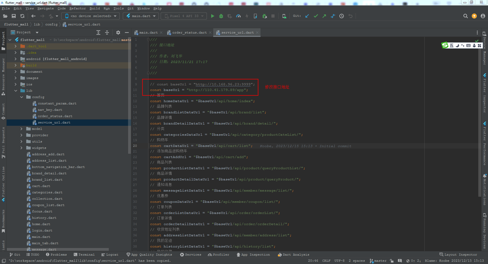
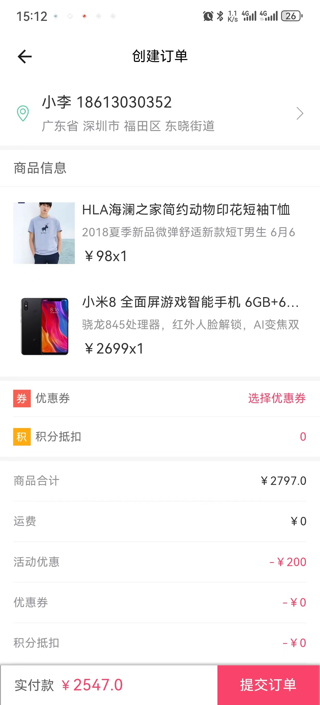

# 本地开发

## 下载代码
```shell
git clone https://github.com/feihua/flutter_mall.git
```

## 修改配置
**修改后端接口地址：flutter_mall\lib\config\service_url.dart**



## 启动项目
```shell
flutter pub get
flutter run
```

<font size=5>**在p40下的效果**</font>

**首页**

**确认订单页**

**个人页**

**支付页**

