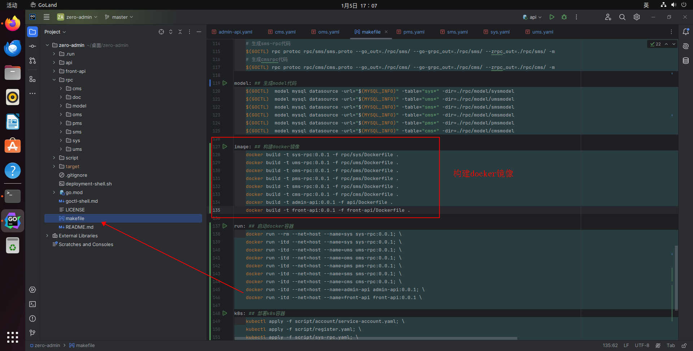

# 在docker上部署

## 安装docker

```shell
curl -fsSL https://get.docker.com | bash -s docker --mirror Aliyun
```


## 构建镜像

在linux下提供makefile脚本,构建docker镜像

```shell
make image

```



## 启动服务

在linux下提供makefile脚本,启动docker镜像

```shell
make run
```


::: tip
**具体脚本在zero-admin\makefile**。
:::
