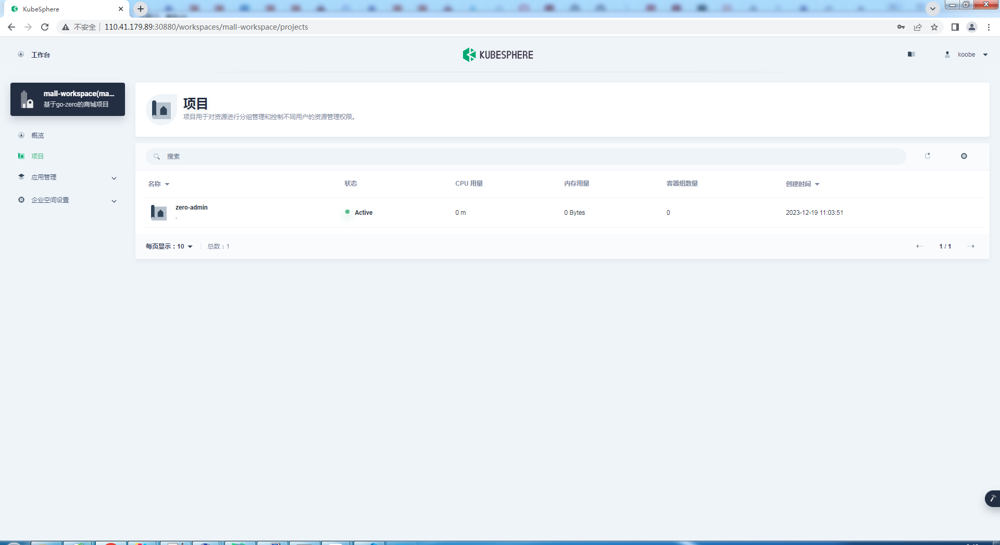
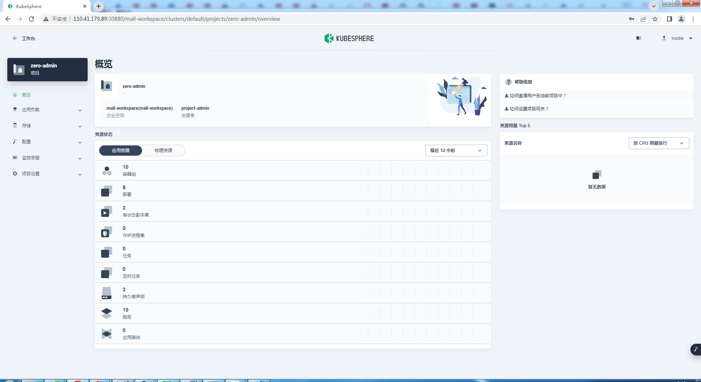
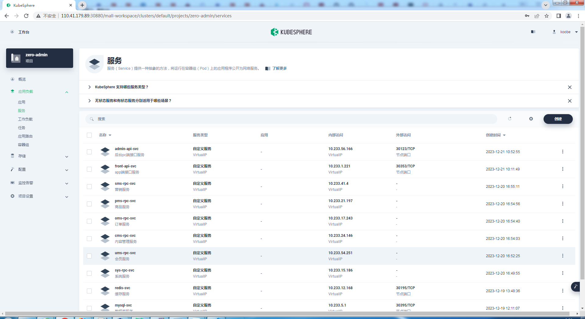
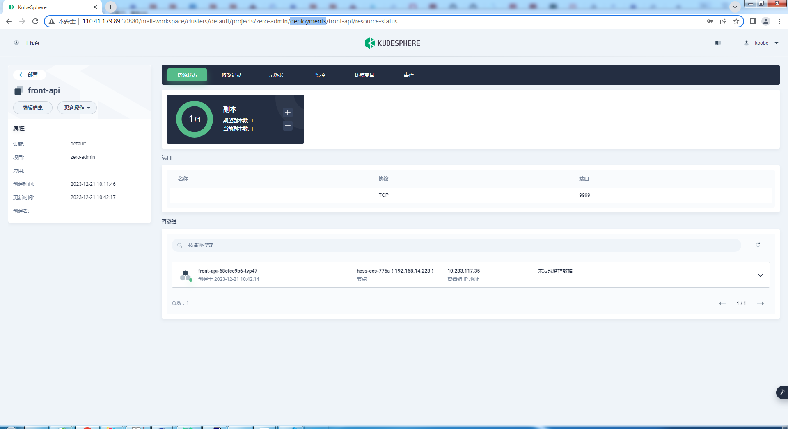
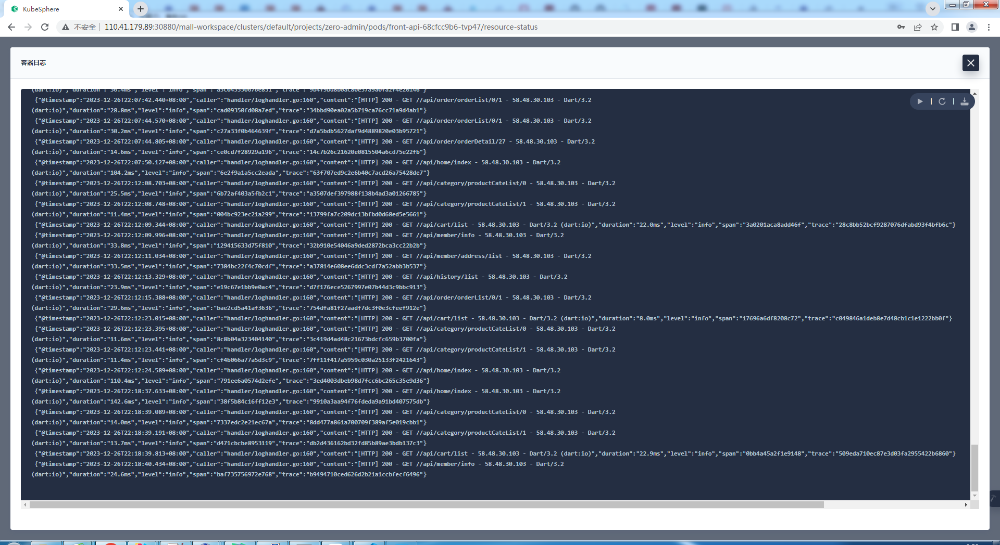

# 在k8s上部署

## 1.效果

### 1.1项目预览



### 1.2项目概览



### 1.3项目服务



### 1.4工作负载


### 1.5容器组


### 1.6front-api的deployments



### 1.7front-api的pods


### 1.8front-api的日志



## 2.脚本

<font face="宋体" color=red size=5>具体脚本在zero-admin\script\目录</font>

### 2.1执行顺序

```shell
kubectl apply -f service-account.yaml(可选,如果把K8s作为注册中心这个就是必须的)
kubectl apply -f register.yaml(可选,如果把K8s作为注册中心这个就是必须的)

kubectl apply -f sys-rpc.yaml
kubectl apply -f ums-rpc.yaml
kubectl apply -f sms-rpc.yaml
kubectl apply -f pms-rpc.yaml
kubectl apply -f oms-rpc.yaml
kubectl apply -f cms-rpc.yaml

kubectl apply -f admin-api.yaml
kubectl apply -f front-api.yaml
```

::: tip
serviceaccount.yaml是获取k8s api的权限

register.yaml 是注册中心(etcd或者k8s),如果不配置,注册中心默认为etcd
:::
