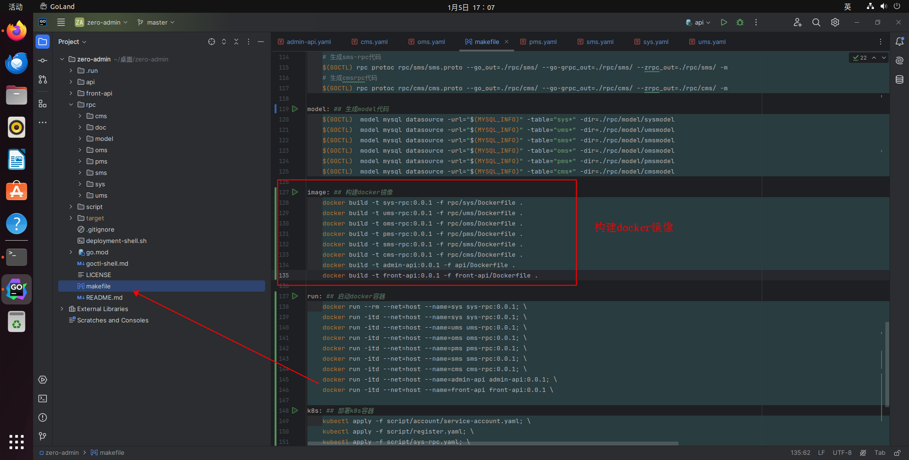
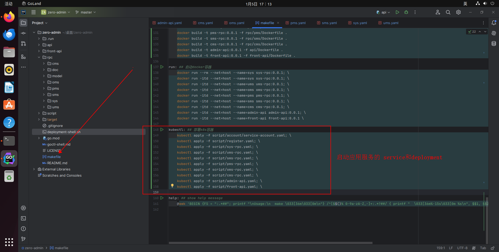

# 在k8s上部署

## 1.安装 KubeSphere

参考：[在 Linux 上以 All-in-One 模式安装 KubeSphere](https://www.kubesphere.io/zh/docs/v3.4/quick-start/all-in-one-on-linux/)

```shell
export KKZONE=cn
./kk create cluster --with-kubernetes v1.22.12 --with-kubesphere v3.4.1
```
::: tip
文档上没有提示这个 export KKZONE=cn, 加上这个,镜像将走国内网络

:::

## 2.脚本

<font face="宋体" color=red size=5>具体脚本在zero-admin\script\目录</font>

### 2.1 构建镜像

在linux下提供makefile脚本,构建docker镜像

```shell
make image

```



### 2.2 启动服务

在linux下提供makefile脚本,启动k8s脚本

```shell
make kubectl
```



::: tip
serviceaccount.yaml是获取k8s api的权限

register.yaml 是注册中心(etcd或者k8s),如果不配置,注册中心默认为etcd
:::

## 3.效果

**3.1项目预览**


**3.2项目概览**


**3.3项目服务**


**3.4工作负载**


**3.5容器组**


**3.6front-api的deployments**


**3.7front-api的pods**


**3.8front-api的日志**


