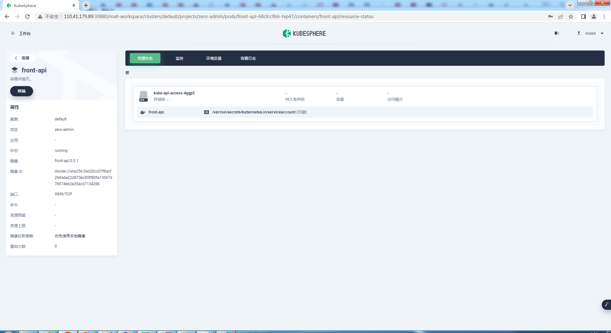

# 在k8s上部署

## 1.效果

### 1.1项目预览

### 1.2项目概览

### 1.3项目服务

### 1.4工作负载

### 1.5容器组

### 1.6front-api的deployments

### 1.7front-api的pods

### 1.8front-api的日志

## 2.脚本

具体脚本在zero-admin\script\目录

### 2.1执行顺序

* zero-admin\script\account\serviceaccount.yamll(可选,如果把K8s作为注册中心这个就是必须的)
* zero-admin\script\configmap\register.yaml(可选,如果把K8s作为注册中心这个就是必须的)
* 其它不限顺序

::: tip
serviceaccount.yaml配置获取k8s api的权限

register.yaml 配置注册中心(etcd或者k8s),如果不配置,注册中心默认为etcd
:::
