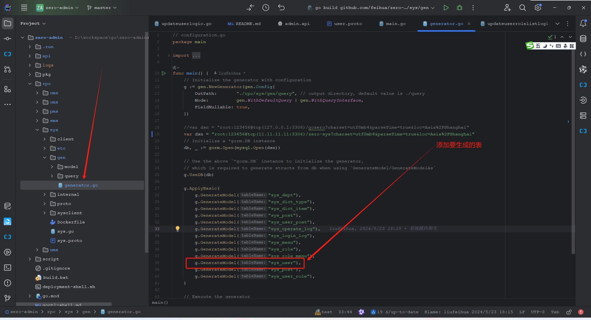
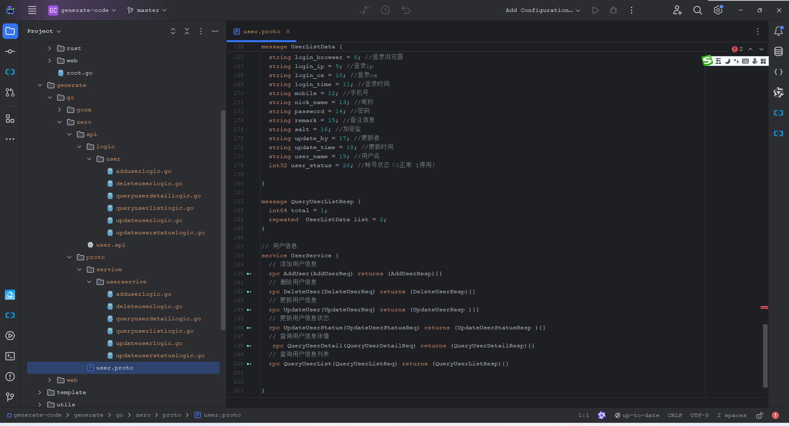
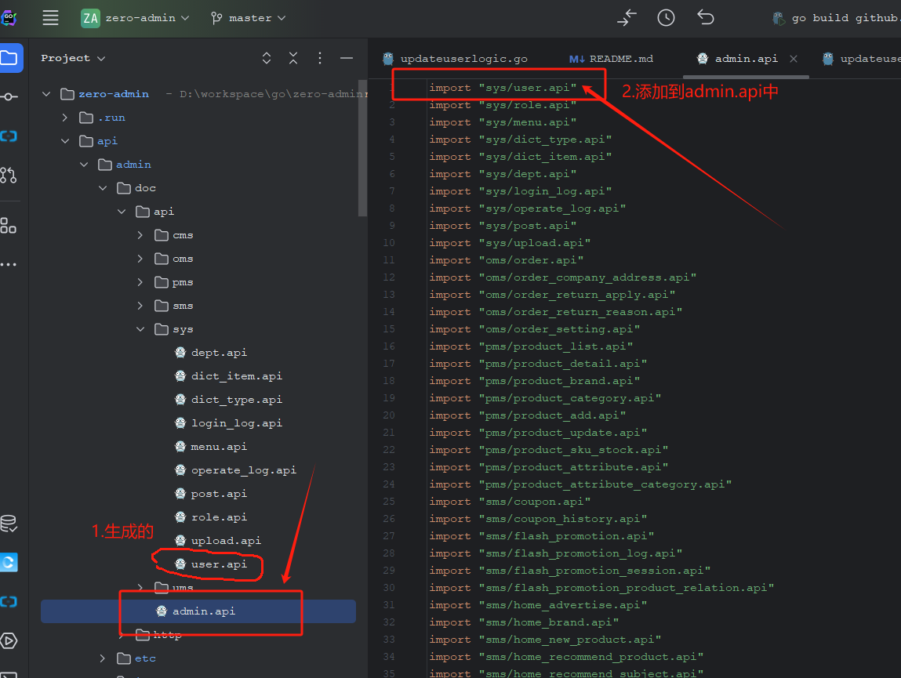
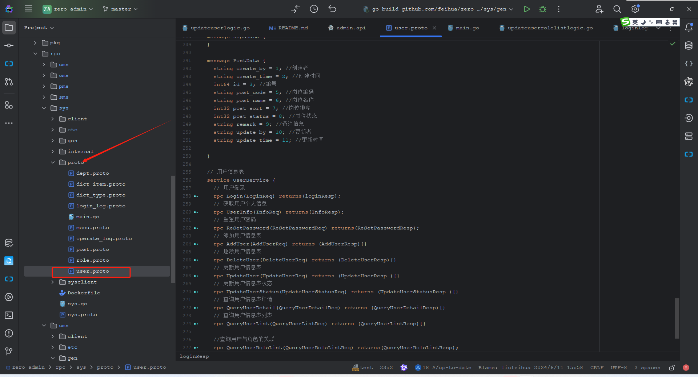
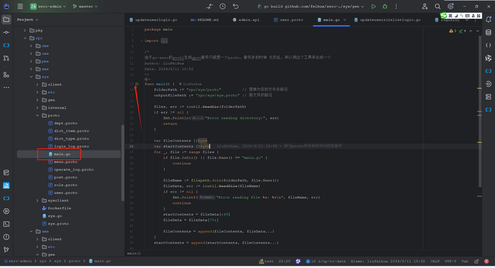
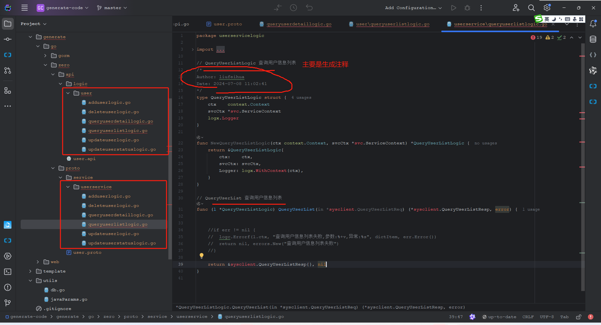

# 二次开发(重点)-新版本

## 1.相关工具
1. goctl(根据api或者proto生成go-zero相关代码)
```shell
go install github.com/zeromicro/go-zero/tools/goctl@latest
goctl env check --install --verbose --force
```
2. generate-code(根据数据库表生成xx.api和xx.proto文件)
```shell
https://github.com/feihua/generate-code.git
```

## 2.以用户表为例：
1. 设计用户表
2. 使用gorm的gen生成model
3. 生成api和proto文件
4. 使用goctl根据api生成代码
5. 使用goctl根据proto生成代码
6. 拷贝生成的代码到api或rpc中（可选）

## 开发流程(重点)
* <font face="宋体" color=red size=5>这个是重点!</font>
* <font face="宋体" color=red size=5>这个是重点!</font>
* <font face="宋体" color=red size=5>这个是重点!</font>

### 2.1. 设计用户表

```sql
create table gozero.sys_user
(
    id          bigint auto_increment comment '编号'
        primary key,
    name        varchar(50)                         not null comment '用户名',
    nick_name   varchar(150)                        null comment '昵称',
    avatar      varchar(150)                        null comment '头像',
    password    varchar(100)                        not null comment '密码',
    salt        varchar(40)                         not null comment '加密盐',
    email       varchar(100)                        null comment '邮箱',
    mobile      varchar(100)                        null comment '手机号',
    status      tinyint                             not null comment '状态  0：禁用   1：正常',
    dept_id     bigint                              not null comment '部门id',
    job_id      int                                 not null comment '岗位id',
    create_by   varchar(50)                         not null comment '创建者',
    create_time timestamp default CURRENT_TIMESTAMP not null comment '创建时间',
    update_by   varchar(50)                         null comment '更新者',
    update_time datetime  default CURRENT_TIMESTAMP null on update CURRENT_TIMESTAMP comment '更新时间',
    del_flag    tinyint   default 1                 not null comment '是否删除  0：已删除  1：正常',
    constraint name
        unique (name)
)
    comment '用户管理';


```
### 2.2 使用gorm的gen生成model

```shell
go run rpc/sys/gen/generator.go
```

### 2.3 生成api和proto文件

**主要是使用代码生成器**
```shell
https://github.com/feihua/generate-code.git
```

执行生成代码
```shell
go run main.go golang zero --dsn "root:123456@tcp(127.0.0.1:3306)/zero-sys" --tableNames sys_user --prefix sys_  --rpcClient sysclient --author liufeihua

dsn: 数据库的地址
tableNames: 表名称
prefix: 生成表时候去掉前缀
author: 作者名称
rpcClient 生成rpc的模块名称
```
下图是生成的代码：



### 2.4 使用goctl根据api生成代码

**把上面生成的user.api放到项目对应的目录（我现在放到admin下）**


使用goctl工具生成代码即可
```shell

goctl api go -api ./api/doc/api/admin.api -dir ./api/
```
### 2.5 使用goctl根据proto生成代码
**把上面生成的user.proto放到项目对应的目录（我现在放到rpc/sys/proto下）**

* <font face="宋体" color=red size=5>由于go-zero的goctl生成gprc服务只能是一个proto，服务多的时候 比较乱，所以用这个工具来合成一个</font>

在生成rpc代码生，要先执行


最后执行goctl生成rpc代码
```shell
# 生成sys-rpc代码
goctl rpc protoc rpc/sys/sys.proto --go_out=./rpc/sys/ --go-grpc_out=./rpc/sys/ --zrpc_out=./rpc/sys/ -m
```
### 2.6 拷贝生成的代码到api或rpc中（可选）


::: tip
**为了减少生成代码复杂度,不进行模板定制,和官方的一样**。
:::

