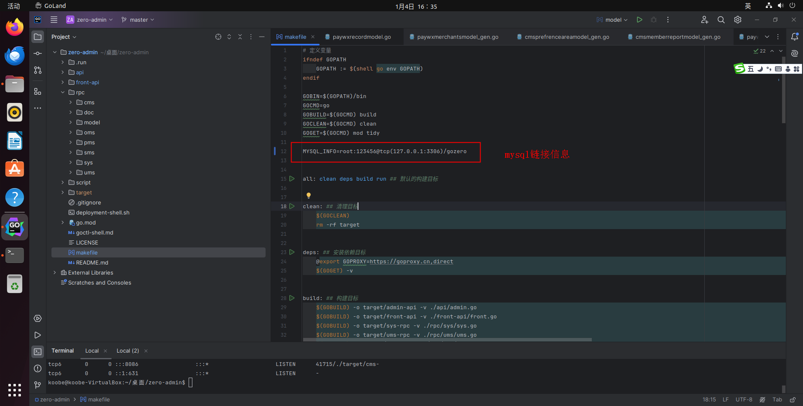

# 二次开发(重点)

<font face="宋体" color=red size=5>二次开发主要是根据goctl工具生成新的接口代码</font>

**安装goctl**
```shell
go install github.com/zeromicro/go-zero/tools/goctl@latest
```

## 1.window下常用脚本
以下脚本在zero-admin项目根目录执行

**1.1生成api和rpc代码**
```shell
# admin-api代码
goctl api go -api ./api/doc/api/admin.api -dir ./api/
# 生成front-api代码
goctl api go -api ./front-api/doc/api/front.api -dir ./front-api/
# 生成sys-rpc代码
goctl rpc protoc rpc/sys/sys.proto --go_out=./rpc/sys/ --go-grpc_out=./rpc/sys/ --zrpc_out=./rpc/sys/ -m
# 生成ums-rpc代码
goctl rpc protoc rpc/ums/ums.proto --go_out=./rpc/ums/ --go-grpc_out=./rpc/ums/ --zrpc_out=./rpc/ums/ -m
# pms-rpc代码
goctl rpc protoc rpc/pms/pms.proto --go_out=./rpc/pms/ --go-grpc_out=./rpc/pms/ --zrpc_out=./rpc/pms/ -m
# 生成oms-rpc代码
goctl rpc protoc rpc/oms/oms.proto --go_out=./rpc/oms/ --go-grpc_out=./rpc/oms/ --zrpc_out=./rpc/oms/ -m
# 生成sms-rpc代码
goctl rpc protoc rpc/sms/sms.proto --go_out=./rpc/sms/ --go-grpc_out=./rpc/sms/ --zrpc_out=./rpc/sms/ -m
# 生成cmsrpc代码
goctl rpc protoc rpc/cms/cms.proto --go_out=./rpc/cms/ --go-grpc_out=./rpc/cms/ --zrpc_out=./rpc/cms/ -m
```
**1.2生成model**
```shell
goctl  model mysql datasource -url="root:123456@tcp(127.0.0.1:3306)/gozero" -table="sys*" -dir=./rpc/model/sysmodel
goctl  model mysql datasource -url="root:123456@tcp(127.0.0.1:3306)/gozero" -table="ums*" -dir=./rpc/model/umsmodel
goctl  model mysql datasource -url="root:123456@tcp(127.0.0.1:3306)/gozero" -table="sms*" -dir=./rpc/model/smsmodel
goctl  model mysql datasource -url="root:123456@tcp(127.0.0.1:3306)/gozero" -table="oms*" -dir=./rpc/model/omsmodel
goctl  model mysql datasource -url="root:123456@tcp(127.0.0.1:3306)/gozero" -table="pms*" -dir=./rpc/model/pmsmodel
goctl  model mysql datasource -url="root:123456@tcp(127.0.0.1:3306)/gozero" -table="cms*" -dir=./rpc/model/cmsmodel
```

::: tip
注意这个参数：-url="root:123456@tcp(127.0.0.1:3306)/gozero" 修改为你自己的
:::

## 2.linux下常用脚本
在linux下提供makefile脚本

```shell
# 生成api和rpc代码
make gen 

# 生成model代码
make model 
```

**生成model的时候,记得修改makefile中mysql链接的信息**



::: tip
**为了减少生成代码复杂度,不进行模板定制,和官方的一样**。
:::

