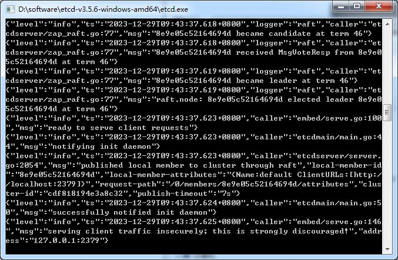
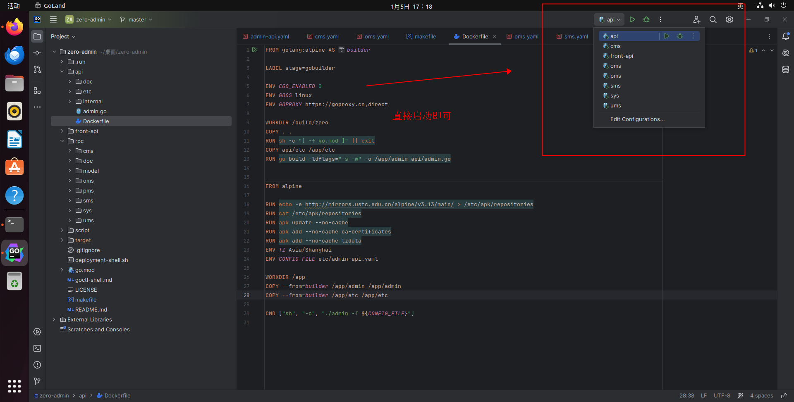
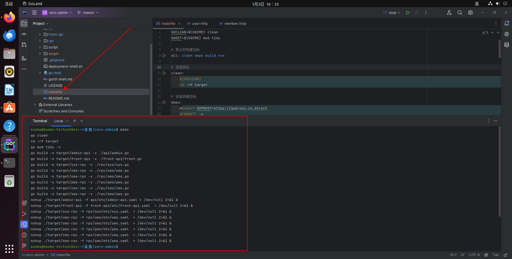
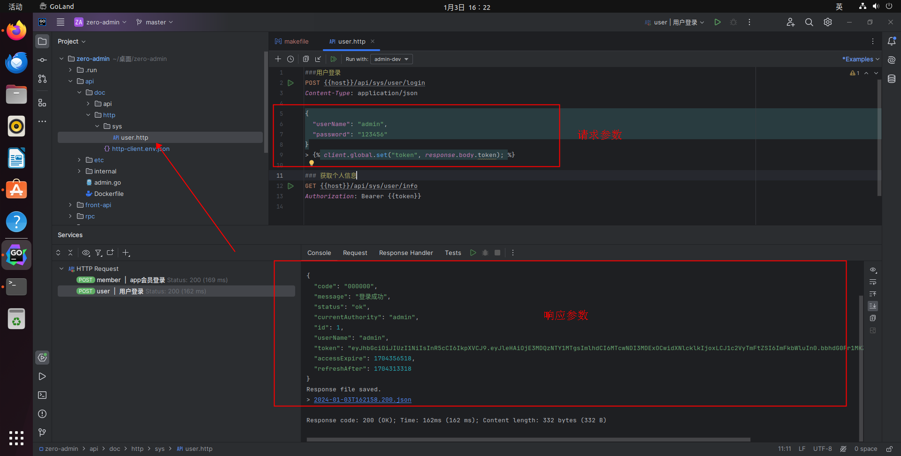
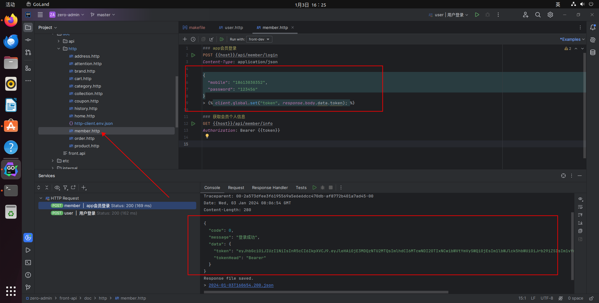

# 本地启动

## 1.下载代码
```shell
git clone https://github.com/feihua/zero-admin.git
```
## 2.导入sql脚本

脚本位置在项目的 zero-admin\rpc\doc\sql 目录下
## 3.修改配置
**3.1修改redis配置**

配置信息目录：zero-admin\api\etc\admin-api.yaml
```yaml
Redis:
  Address: 127.0.0.1:6379
  Pass: 62956dh5k9ed
```

<font color=Red>把上面信息修改为你自己的redis配置信息</font>

**3.2修改mysql配置**

mysql配置主要在rpc服务下面
```yaml
Mysql:
  Datasource: root:123456@tcp(127.0.0.1:3306)/gozero?charset=utf8mb4&parseTime=true&loc=Asia%2FShanghai

```
<font color=Red>把上面信息修改为你自己的mysql配置信息</font>

## 3.启动etcd

**3.1 window下启动**


**3.2 linux下启动**
```shell
wget https://github.com/etcd-io/etcd/releases/download/v3.5.11/etcd-v3.5.11-linux-amd64.tar.gz
tar -zxvf etcd-v3.5.11-linux-amd64.tar.gz
cd etcd-v3.5.11-linux-amd64
nohup ./etcd --listen-client-urls http://0.0.0.0:2379 --advertise-client-urls http://0.0.0.0:2379 &
```
::: tip
**根据自己的实际情况而定。**
:::

## 4.启动项目

**4.1 goand idea工具顶部栏启动**




**4.2 makefile方法启动**

```shell
make
```



## 5.验证服务
**5.1后端接口验证**
zero-admin\api\doc\http\sys\user.http

**用户登录**

**5.2移动端接口验证**
zero-admin\front-api\doc\http\member.http

**app会员登录**




::: tip
**记得修改上面的host变量为你自己的ip**

<font color=Red>测试其它脚本之前,必须执行上面二个接口先登录拿到token,再测其它接口</font>
:::

