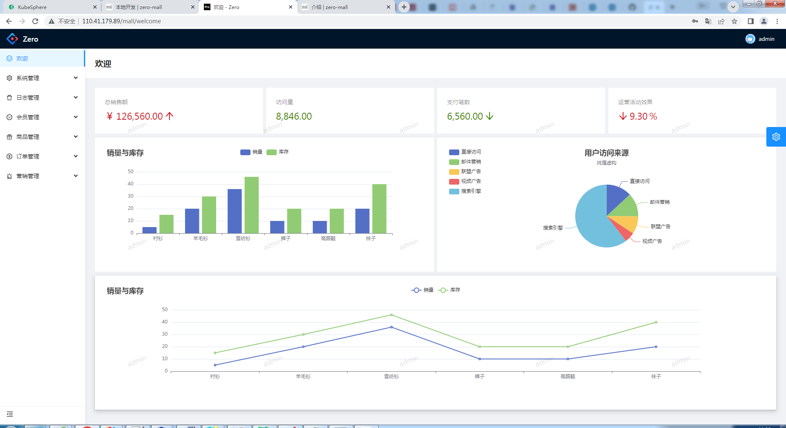
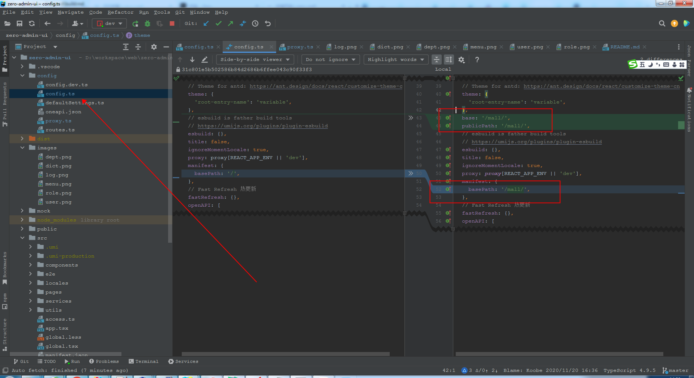

# 项目部署

**在centos7下安装nginx**
```shell
yum install -y nginx
```

::: tip

默认根路径是：/usr/share/nginx/html

默认的端口是：80
:::

<font color=Red>项目部署在nginx下会有二种情况：1.nginx的根目录,2,非根目录</font>

## 1.nginx的根目录
部署在nginx的根目录,默认配置即可,不用修改配置

```shell
npm run build
```

::: tip

直接把dist目录下的文件拷贝进 /usr/share/nginx/html 即可
:::

浏览器打开: [http://110.41.179.89/](http://110.41.179.89/mall)即可</font>



## 2.非根目录

**如果有多个项目,nginx的根目录就不够用了,所有要加目录来区分,比如：a和b项目**

http://127.0.0.1:80/a-----》/usr/share/nginx/html/a

http://127.0.0.1:80/b-----》/usr/share/nginx/html/b

<font color=Red>下面以mall为例</font><p>
http://127.0.0.1:80/mall-----》/usr/share/nginx/html/mall

### 2.1修改配置
**修改项目配置：web\zero-admin-ui\config\config.ts**



添加右边红框的内容
### 2.2添加nginx配置
**nginx的配置 /etc/nginx/nginx.conf**
```yaml
location ^~ /mall{
	alias html/mall;
	index index.html; 
	try_files $uri $uri/ /mall/index.html;
}
```

### 2.3部署
```shell
npm run build
```
把dist目录下的文件拷贝进 <font color=Red>/usr/share/nginx/html/mall</font> 即可

### 2.4访问
浏览器打开: [http://110.41.179.89/mall](http://110.41.179.89/mall)即可</font>


## 总结
::: tip

项目部署在nginx的根目录和非根目录,主要区别是：非根目录添加访问前缀
:::

