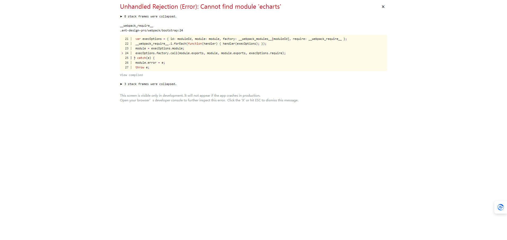

# 本地开发

## 下载代码
```shell
git clone https://github.com/feihua/zero-admin-ui.git
```
## 安装依赖
**进入目录zero-admin-ui**
```shell

npm install --legacy-peer-deps
```
## 修改配置
**修改代理地址：zero-admin-ui\config\proxy.ts**
```ts
export default {
  dev: {
    // localhost:8000/api/** -> https://preview.pro.ant.design/api/**
    '/api/': {
      // 修改为后端接口地址
      target: 'http://139.159.180.129:8888/',
      // 配置了这个可以从 http 代理到 https
      // 依赖 origin 的功能可能需要这个，比如 cookie
      changeOrigin: true,
      pathRewrite: {'^': ''},
    },
  },

};
```
::: tip

target: 'http://139.159.180.129:8888/',     // 修改为后端接口地址
:::
## 项目启动

```shell
npm run dev

省略启动过程...

App running at:
- Local:   http://localhost:8000 (copied to clipboard)
- Network: http://10.168.96.23:8000

```

## 访问
浏览器打开: [http://127.0.0.1:8000](http://127.0.0.1:8000)即可</font>


::: warning

现在默认启动的是在根路径的,如果加了非根路径,记得在访问地址加上,例如mall目录,访问地址则为[http://127.0.0.1:8000/mall](http://127.0.0.1:8000/mall)

在下一章项目部署的时候,将介绍部署在nginx根目录和非根目录
:::


## 问题
如访问的时候报：Unhandled Rejection (Error): Cannot find module 'echarts'



解决方法： 删除 .umi 文件夹，然后重新启动,再不行就重新安装依赖npm install
